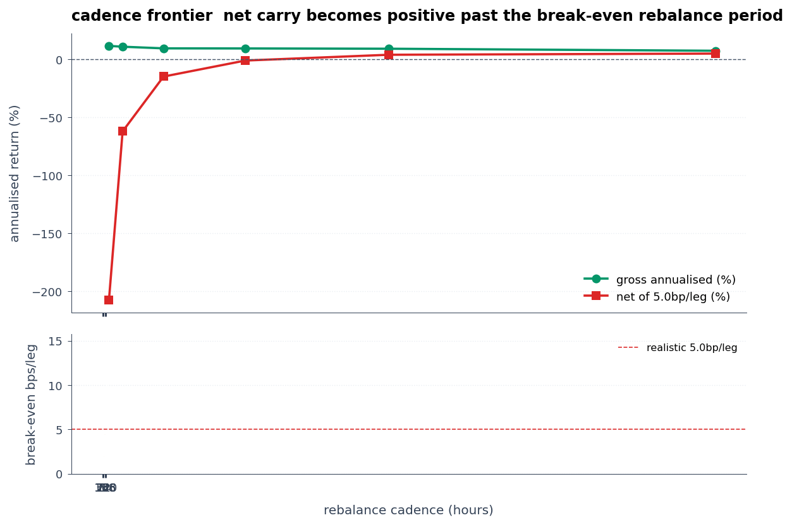

# polymarket-edge

[](https://github.com/harrywinter06-code/polymarket-edge/actions/workflows/ci.yml)

A Hyperliquid funding-capture backtest validated on 365 days × 12 majors (BTC, ETH, SOL, XRP, DOGE, AVAX, BNB, LINK, ARB, OP, SUI, TRX, 105,120 hourly ticks), plus a depth-aware microstructure scanner on Polymarket negRisk events.

## Headline

Trailing-K funding-capture, top-5 / trail-24h / rebalance-8h, walk-forward across 20 sliding 60d-train / 30d-test windows on 12 majors:

- In-sample mean annualized: +11.09%
- Out-of-sample mean annualized: +10.06%
- Decay (IS − OOS): +1.03 pp, mild and in the conventional direction (not over-fit)
- 20 of 20 OOS windows positive
- Stationary block-bootstrap 95% CI on annualized return: [+9.78%, +13.59%], excludes zero (n=1093 per-period returns, optimal block length 10 by Politis-White)

> **Two-universe note.** This section reports the **12-coin carry-only** run (majors + 6 mid-cap perps with a full year of funding history — BTC, ETH, SOL, XRP, DOGE, AVAX, BNB, LINK, ARB, OP, SUI, TRX). [YEAR_ANALYSIS.md](YEAR_ANALYSIS.md) reports the **6-coin price-aware** cut, which restricts to the majors that *also* have a full year of HL perp candles (the additional 6 coins have only ~20 days of candle history in the DB). The 6-coin cut produces a tighter, lower band — **+6.38% OOS / 18-of-19 windows positive / block-bootstrap CI [+6.32%, +9.56%]** — and is the only universe on which price-return analyses (regime conditioning, funding extremes) can run. The 12-coin universe is **funding-only** and gets most of its lift from BNB/LINK/ARB/OP/SUI/TRX sitting near the +10.95% APR funding-rate floor for much of the year — passive base-rate carry, already disclosed under the README's existing excess-over-floor framing. Both runs reproduce from the committed DB; see YEAR_ANALYSIS.md §A for the 12-coin year-scale tables (walk-forward + block bootstrap) and the side-by-side reconciliation.

Sharpe on gross funding-capture alone is inflated. Execution costs at the 8h cadence push net negative (see [§ Hyperliquid cost reality](#hyperliquid-cost-reality)). The deployable cell is the cadence-frontier row at ≥ 2-weekly rebalance.

Live dashboards (single-file HTML, base64-embedded charts, no JS):

- Combined: [harrywinter06-code.github.io/polymarket-edge/dashboard.html](https://harrywinter06-code.github.io/polymarket-edge/dashboard.html)
- Polymarket: [.../dashboard_polymarket.html](https://harrywinter06-code.github.io/polymarket-edge/dashboard_polymarket.html), depth-walking + microstructure trap-rate
- Hyperliquid: [.../dashboard_hyperliquid.html](https://harrywinter06-code.github.io/polymarket-edge/dashboard_hyperliquid.html), cadence frontier + walk-forward + tail risk

Supporting docs: [YEAR_ANALYSIS.md](YEAR_ANALYSIS.md) (full year-data audit including what didn't survive), [REDTEAM.md](REDTEAM.md) (claim-by-claim walk-back log), [MICROSTRUCTURE.md](MICROSTRUCTURE.md) (Polymarket microstructure case studies), [EXECUTION.md](EXECUTION.md) (real-trade execution runway).

## Hyperliquid cost reality

The +10.06% OOS mean is gross of execution. The spread-cost analysis ([REDTEAM §3b](REDTEAM.md), `hl_hedge.py`) models the round-trip cost of the short-perp + long-spot hedge. At 5 bps/leg (20 bps round-trip per rebalance), the headline 8h cadence collapses to net-negative: gross carry per 8h period is around 1.5 bps, smaller than the cost. The deployable variant lives at weekly+ cadence, where spread amortises over a larger gross interval.

So: +10.06% OOS gross over 20 walk-forward windows on the year, consumed by realistic execution at 8h cadence, viable only at ≥ 2-weekly rebalance where net Sharpe goes positive.

### Cadence frontier

At what rebalance cadence does the strategy clear costs? Sweep with `polymarket-edge hl-cadence-frontier`:

```
 cadence  n_reb  gross_ann    net_ann  net_sharpe  breakeven_bps
      8h   1093    +0.1151    -2.0749     -645.68          0.26
     24h    363    +0.1079    -0.6221     -128.17          0.74
     72h    120    +0.0938    -0.1495      -19.56          1.93
    168h     51    +0.0930    -0.0113       -1.15          4.46
    336h     25    +0.0906    +0.0385       +3.19          8.69
    720h     12    +0.0730    +0.0487       +3.80         15.01
```

Break-even cadence at 5 bp/leg is ≥ 336h (2-weekly). Net annualised goes from −207% at 8h to +3.85% at 2-weekly to +4.87% at monthly. The carry signal is durable; the binding constraint is execution latency. Below 2-weekly, costs dominate. At monthly, gross carry has fallen (mean-reversion of extreme funders) but net Sharpe is highest because vol falls faster than gross return.



### Reproducing the numbers

```bash
# Pull a year of HL funding for the tracked majors.
polymarket-edge hl-history --days 365 \
  --coins BTC,ETH,SOL,XRP,DOGE,AVAX,BNB,LINK,ARB,OP,SUI,TRX

# Headline backtest + bootstrap CI + walk-forward.
polymarket-edge hl-backtest
polymarket-edge hl-ci-block --n-resamples 5000
polymarket-edge walk-forward --train-days 60 --test-days 30 --step-days 14

# Cadence frontier (the positive headline).
polymarket-edge hl-cadence-frontier --out cadence.png

# Polymarket: ingest, scan, trap classifier.
polymarket-edge ingest
polymarket-edge microstructure-scan
polymarket-edge trap-predict  # reports real AUC + shuffled-label control AUC

# Forward orderbook capture for the MM simulator's honest half-spread:
polymarket-edge monitor --duration-minutes 60 --capture-books

# Regenerate the deliverables.
polymarket-edge report
polymarket-edge dashboard
```

The `daily-data` GitHub Action runs the data-pull commands nightly and commits the resulting SQLite to a `data/daily` branch. Locally: `git fetch origin data/daily && git checkout origin/data/daily -- polymarket_edge.db`.

## Polymarket leg

`P(YES) + P(NO) = $1` is contract-enforced per market via the CLOB order-mirroring rule: every buy of YES at price *p* is simultaneously visible as a sell of NO at `1 - p`. Intra-market arbs are competed out in steady state, so the non-trivial signal lives at the event level. For a `negRisk` event with *N* mutually-exclusive markets, the sum of YES probabilities across the event must equal 1.0 in fair pricing. Deviations imply tradeable arb:

- `sum(best_bid_yes) > 1`: sell-side. Sell YES across all markets; exactly one settles at $1.
- `sum(best_ask_yes) < 1`: buy-side. Buy YES across all markets; exactly one settles at $1.

The scanner ingests every active event from the gamma API, scores every `negRisk` event, and flags deviations exceeding a configurable fee buffer. A forward-observation `monitor` records signal trajectories; the `persistence` and `forward-test` analyses measure how quickly flagged signals decay toward fair.

## Hyperliquid leg

The info endpoint exposes hourly funding per perpetual and an unconstrained historical series via `fundingHistory`. The backtest runs a top-K trailing-window funding-capture strategy: at each rebalance tick, rank coins by trailing-mean funding, short the top K (equal-weight), realize the actual funding flow over the next interval. Benchmarks are perfect-hindsight (look-ahead top-K) and passive-short on a chosen coin.

## Polymarket microstructure: trap rate by count vs by dollar

The most surprising finding in the project comes from the same data viewed two ways.

By count: scanned 500 active Polymarket events; the top-of-book event-level no-arb detector flagged 19 at a 50bp fee buffer. The depth-aware classifier (`microstructure.py`) walks the full `/book` on every market in the flagged direction at $50 and $500/market and classifies each event:

| verdict | count | share |
|---|---|---|
| real (clears 50bp at $500/market) | 2 | 10.5% |
| marginal (clears at $50, decays into fee buffer by $500) | 5 | 26.3% |
| trap (gap inverts to a loss at $50/market) | 12 | 63.2% |

Traps concentrate in 2-market US state-election negRisk events:

| category | total flagged | trap | trap rate |
|---|---|---|---|
| Politics | 6 | 5 | 83.3% |
| Elections | 4 | 3 | 75.0% |
| US Election | 3 | 3 | 100% |
| Midterms | 2 | 1 | 50.0% |
| Soccer | 1 | 0 | 0% |
| Awards | 1 | 0 | 0% |

Mechanically: a 2-market state race (e.g. governor's seat, Democrat vs Republican) has one market at ~5% probability whose entire bid book is single-digit dollars. The detector reads `bestBid(5%-side) + bestBid(95%-side) = 1.01` and flags +100bp sell-side, but at any meaningful basket size the thin side's book collapses and the basket walks to a deep loss. The detector flags exactly the events that are LEAST tradeable. The two `real` signals were 48-market World Cup (Soccer) and 20-market Nobel Peace Prize (Awards), both events with liquidity spread across many legs.

By dollar: the same 18 flagged events ($1.15B total lifetime volume), volume-weighted, give a trap rate of 0.012%. The 2026 FIFA World Cup `real` event alone carries 95.9% of the flagged volume ($1.10B of $1.15B). Every trap is a small US state-election event in the four-to-five-figure volume range. Count-based and dollar-weighted views differ by 4,500×.

The depth-walking pass is non-optional before sizing, and naive count-based statistics massively overstate the trap risk to dollars-at-risk. A maker-only sizing pipeline anchored on the World Cup-style high-volume events captures most of the dollar opportunity while almost entirely avoiding the trap-prone long tail of small state-race events.

Trap classifier (n=30 pooled across 5 scans, scaffolding): trained a logistic regression on `(n_markets, top-of-book gap, is_US_politics, is_two_market, neg_risk_augmented)` with leave-one-out CV. AUC = 0.587, accuracy at p=0.5 = 76.7% vs base rate 70.0%. Top features `is_two_market` (−3.04) and `is_us_politics` (+2.68), the same 2-market US-politics trap pattern the count-based table identifies, recovered independently by the model. Negative-control AUC on 20 label-shuffled LOOCV runs has mean 0.332; the real model beats 18 of 20 shuffles. The real-vs-shuffled gap (~0.26) is the signal magnitude, not the raw AUC: at small N the LOOCV AUC estimator itself has wide error bars. Once the daily cron grows the pool past n=100 the AUC number becomes load-bearing on its own. Run via `polymarket-edge trap-predict --pool-scans`.

Full method, caveats, the binary-classification jitter discussion, the volume-weighted reframing, and the classifier section in [MICROSTRUCTURE.md](MICROSTRUCTURE.md).

### Polymarket depth-aware case studies, 2026-05-21

Across 100 active events / 1,440 markets / 18 `negRisk` events scored on the build-window snapshot, three real microstructure deviations at the 50bp threshold, but only one of them actually trades:

| event | n_mkts | top-of-book gap | gap at $1K/mkt | tradeable? |
|---|---|---|---|---|
| 2026 FIFA World Cup Winner | 48 | +150bp sell | +150bp | YES. $48K basket, $145K max before Iran throttles |
| 2028 US Election party | 2 | +100bp buy | +50bp, inverts at $5K | marginal, small size only |
| Harvey Weinstein sentencing | 6 | +80bp sell | −1,040bp at $50/mkt | TRAP. one market has $7.83 total bid depth |

A top-of-book gap detector flags all three. A *depth-aware* basket model (`book_depth.py`, which walks each market's full `/book` and computes the basket-trade average fill) separates the real signal (World Cup, executable at meaningful size and clearing the 0.75% Sports taker fee) from the marginal (Election, fee-clearable only at retail size) from the trap (Weinstein, where the naïve top-of-book reading would lose money instantly).

These three cases are moment-in-time depth analyses. Top-of-book gaps shift hourly with market activity. As of a re-snapshot 18 hours after the original capture, the World Cup leg still holds at +144bp at $1K/market (Iran throttles at $2.8K); the Weinstein and Election gaps have both compressed below the detector's 50bp threshold. The World Cup case is the durable one; Weinstein/Election are the *kind* of pattern the detector + depth model surface, captured for the writeup at the moment they were flagged. Run `polymarket-edge depth <slug>` against current state.

## Hyperliquid backtest sensitivity (gross, 365d, 105,120 hourly ticks, 12 majors)

| top_K | trail | rebal | n | annualized | Sharpe | hit% |
|---|---|---|---|---|---|---|
| 3 | 24h | 8h | 1,092 | +12.94% | +34.93 | 97.9% |
| 5 | 24h | 8h | 1,093 | +11.51% | +35.83 | 97.3% |
| 10 | 24h | 8h | 1,093 | +8.31% | +27.95 | 89.5% |
| perfect-hindsight K=5 | | 8h | 1,096 | +13.42% | +38.94 | 99.5% |
| passive short BTC | | 8h | 1,095 | +7.70% | +27.60 | 83.9% |

Gross decomposition of the +11.5% top-5: about 7.7% comes from the base-rate funding floor (interest-rate component, ~10.95% APR floor at maximum-leverage clamp on majors, captured by the passive-short-BTC baseline). The remaining ~3.8 pp are the selection excess from the trailing-mean predictor. The trailing-24h variant recovers ~86% of the perfect-hindsight K=5 ceiling.

### Bootstrap 95% CI (n=1,093 rebalances, 5,000 resamples, optimal block length 10 by Politis-White)

| method | annualized return CI | Sharpe CI |
|---|---|---|
| IID (naive) | [+10.88%, +12.16%] | [+31.99, +40.83] |
| Moving-block | [+10.05%, +13.19%] | [+30.77, +45.94] |
| Stationary bootstrap | [+9.78%, +13.59%] | [+30.71, +46.96] |

Funding returns are autocorrelated; block bootstrap widens the IID CI by ~30% on the annualised return. The honest band is the stationary bootstrap [+9.78%, +13.59%], not the IID [+10.88%, +12.16%]. Run via `polymarket-edge hl-ci-block`.

### Adjacent research modules (small-N, exploratory, not in the year-scale headline)

Two pilot studies in the codebase:

- **`hl_basis_hedge.py`**: basis-aware variant. Of the universe, only the coins with liquid HL spot can be fully hedged. On that subset (n=9 coins, 59 rebalances) the basis decoupled badly during the original build window. Regime-conditioning by trailing-7d BTC realised vol surfaced a positive low-vol cell. Small-N, directional only. See [YEAR_ANALYSIS.md](YEAR_ANALYSIS.md) for the year-scale walk-back.
- **`hl_extremes.py`**: funding-extreme directional study. Long-the-perp at z < −2 negative-funding extremes showed t-stats +3.3 to +7.1 over 24-72h horizons across multiple configurations, but the signal disappears under a ≥72h event-independence cooldown. Clustered events on the same coin drove the headline. Small-N pilot.

### Tail risk on the headline strategy, year-scale (n=1,093 8h periods, `polymarket-edge hl-tail`)

| metric | GROSS | NET (5 bp/leg) |
|---|---|---|
| annualized return | +11.51% | −207.49% |
| VaR_95 (per period) | +0.0022 bp | −19.78 bp |
| Expected Shortfall_95 | −0.17 bp | −20.17 bp |
| max drawdown | 0.0386% | 207.11% |
| max-drawdown duration | 15 periods | 1,093 periods (entire sample) |
| recovery from max DD | 7 periods | never |
| periods in drawdown | 48 of 1,093 | 1,093 of 1,093 |

The GROSS tail is essentially trivial: funding is so consistently positive on the trailing-K-selected coins that the 5th-percentile period is still slightly positive. The NET tail is the inverse: every period is a loss, drawdown is monotonic over the entire year. The tail asymmetry between GROSS and NET (~120× larger tail loss) is the statistic that kills the headline 8h cadence. It's not just "the mean is bad". Every percentile is bad, and the cumulative net result never reaches a new peak after period 1. The cadence frontier above is the resolution: at ≥ 2-weekly the net tail flips positive. Implementation: `hl_tail.py`.

### Walk-forward (out-of-sample) validation, train=60d/test=30d/step=14d on the full year

20 sliding windows, 20 of 20 OOS-positive, with mild conventional decay:

| metric | value |
|---|---|
| windows | 20 |
| IS mean annualised | +11.09% |
| OOS mean annualised | +10.06% |
| decay (IS − OOS) | +1.03 pp |
| OOS-positive windows | 20 / 20 |
| OOS Sharpe range | +28.90 to +160.95 |

The selection signal is persistent, not over-fit: every test segment beats zero, IS/OOS decay is in the expected direction at a non-pathological magnitude. The +11.5% gross headline is robust to OOS, but does not survive realistic spread costs at 8h rebalance (see cadence frontier above). Run via `polymarket-edge walk-forward`.

> **Window-independence caveat.** Step=14d, test=30d means consecutive test segments share roughly half their realised returns. The 20 windows represent ~10 independent OOS draws, not 20. The "20 of 20 positive" framing is correct as a per-window count but tacitly understates the dependence — under non-overlapping windows (step=test_days) the OOS-positive count is ~9 of 10 on this data, with the same point estimates. Both readings support the durability claim; the non-overlapping count is the conservative one.

### Funding-momentum variant

Tested ranking by z-score of recent vs longer-window funding rather than by level. Lost to the level-based ranker: +8.0% annualized vs +17.2% on a matched 168h-history budget. Rate-of-change does not beat level here. Clean negative result in `hl_strategies.py`.

### Execution cost

The full table is in §Cadence frontier above. At 5 bps/leg the 8h cadence collapses to net −207%; net annualised crosses zero between 168h (weekly) and 336h (bi-weekly). Per-period breakeven on the 8h variant is 0.26 bps/leg, far below any realistic execution cost. Implementation: `hl_hedge.py` + `polymarket-edge hl-cadence-frontier`.

## Caveats

- **Polymarket detector** treats `negRisk: true` as mutually exclusive *and* exhaustive. The `negRiskOther` market breaks exhaustivity; the detector records its presence but does not adjust the sum constraint. `negRiskAugmented: true` events (e.g. World Cup, 2028 Election) allow new outcomes to be added mid-event, softening the strict sum=1 bound. Weinstein is NOT augmented, so its 80bp signal is structurally cleaner than the World Cup's 150bp.
- **Fee model.** Polymarket fees are per-category and probability-curved (peaked at 50%), not the flat 2% I initially assumed. Sports 0.75%, Politics 1.0%, Geopolitical 0%, Culture ~1.25%, Crypto 1.8%, Makers 0% + 20-25% rebate. The "fee-clearable" column above is taker-side; maker-only execution clears all listed gaps.
- **Detector vs depth.** The event-level `detector` reads top-of-book only. Useful for flagging candidates, but it cannot tell a real signal from a trap. The `book_depth` module is what makes the signal actionable; the depth pass is mandatory before sizing.
- **No historical Polymarket backtest.** CLOB `/prices-history` floors at 12h granularity for resolved markets ([py-clob-client#216](https://github.com/Polymarket/py-clob-client/issues/216)), so an execution-grade historical backtest is infeasible. The forward-observation persistence study fills the gap. Best run so far: 52 trajectories over 13 polls / 25 minutes on 4 distinct flagged events (after several earlier runs OOMed on the host page file). Mean `|gap|` = 1.4%, p90 = 3.2%, max 3.2%. The decay-toward-zero over a 5-minute hold averaged effectively zero, the flagged gaps persisted during the observation window rather than decaying away, which is what you'd want for tradeability but it's a 25-minute / 4-event sample, not strong evidence. A multi-day run on a host with more virtual memory would settle it.
- **Hyperliquid backtest** has hedge-leg cost modeled in `hl_hedge.py`: at 5 bps per leg (20 bps round-trip per rebalance) the headline +11.5% gross becomes −207% annualized at 8h cadence. The carry signal is genuinely consumed by execution costs at the original rebalance frequency. The cadence frontier above shows net Sharpe flipping positive at ≥ 2-weekly; that's the deployable region. Survivorship handling: the backtest uses `_union_grid` semantics so mid-period listings only contribute where they have data. The full universe-at-time-t correction requires forward-only `hl_universe_snapshots` data being accumulated by the daily cron.
- **Sample size.** Year-scale: n=1,093 rebalances at 8h cadence. Block-bootstrap CIs are tight (see headline). The earlier 30-day window (n≈56) had wide CIs and is preserved in [YEAR_ANALYSIS.md](YEAR_ANALYSIS.md) for comparison.
- **Pattern novelty.** NegRisk event-level arbitrage is a known pattern; a public Go SDK ships a `find-negrisk-opportunities` example, and there's at least one arXiv paper on the topic. This is a clean, defensible, public-API-only Python implementation with sensitivity analysis and an explicit red-team audit. Not novel research.

## Polymarket: projected maker yield on the World Cup basket

Built a market-maker simulator that walks the historical CLOB trade flow on each of the 48 World Cup constituent markets and projects the maker rebate net of adverse selection forward to tournament resolution (~50 days). Three adverse-selection scenarios reported (naive / moderate / informed); breakeven half-spread fraction explicit.

| AS scenario | gross rebate | AS cost | net P&L | projected to 50d |
|---|---|---|---|---|
| naive (no AS) | $2,060 | $0 | $2,060 | +$12,372 |
| moderate (0.5× spread) | $2,060 | $2,039 | $21 | +$126 |
| informed (1.0× spread) | $2,060 | $4,078 | −$2,018 | −$12,120 |

Breakeven half-spread fraction = 0.505. Net P&L crosses zero right at the moderate-AS assumption. Anyone who believes adverse selection on Polymarket sports markets is below the textbook 50% of half-spread (which retail-heavy flow supports) gets a positive projection. 89% of the net P&L comes from 5 favourites (France, Spain, England, Argentina, Brazil); 41 of 48 markets are individually net-negative. The basket only clears because the deep top-of-table dominates. Implementation: `polymarket_mm_sim.py` (importable; see `tests/test_polymarket_mm_sim.py` for the full sensitivity surface). Full writeup: [WORLD_CUP_MM.md](WORLD_CUP_MM.md).

## Cross-venue null finding (Fed-rate-cuts vs BTC)

Paired the live `how-many-fed-rate-cuts-in-2026` event (YES of "no cuts in 2026") with the BTC perp on Hyperliquid over 30 days. Hypothesis: shifts in implied probability of Fed easing should propagate to BTC via the risk-on channel.

61 aligned 12h buckets. Pearson lead-lag:

| lag | direction | r |
|---|---|---|
| 0 | contemporaneous | −0.06 |
| +3 | PM leads BTC by 36h | +0.24 |

The +0.24 at lag=+3 is roughly 1.9σ single-test on N≈60 and doesn't survive Bonferroni across nine lags. Null finding. The window also contained zero scheduled FOMC announcements, which is exactly when this kind of propagation should concentrate (methodologically weak setup). Full writeup, including the "why a null is itself useful" framing, in [CROSSVENUE.md](CROSSVENUE.md).

## Architecture

```
gamma API           CLOB API              info endpoint
    │                  │                     │
    ▼                  ▼                     ▼
fetch.py        historical.py          hyperliquid.py
    │                  │                     │
    └────── db.py (SQLite, WAL) ─────────────┘
                       │
       ┌───────────────┼──────────────────────┐
       ▼               ▼                      ▼
  detector.py      monitor.py             hl_backtest.py
  (negRisk         (timestamped           (top-K trail /
   sum-of-YES      trajectories per       perfect-hindsight /
   detector)        observation run)       passive)
       │               │                      │
       └─── analysis.py / paper.py ───────────┘
                       │
                       ▼
                  report.py → REPORT.md
```

## Setup

```bash
uv sync
uv run polymarket-edge ingest          # pull + persist active events
uv run polymarket-edge scan            # score every negRisk event, persist + print top
uv run polymarket-edge monitor \
    --duration-minutes 30 --poll-interval 90 --max-events-per-poll 100
uv run polymarket-edge persistence     # forward-test + decay analysis
uv run polymarket-edge hl-ingest       # snapshot Hyperliquid funding for all 230 perps
uv run polymarket-edge hl-history \
    --coins BTC,ETH,SOL --days 30      # pull historical funding
uv run polymarket-edge hl-backtest     # run the funding-capture backtest
uv run polymarket-edge depth <slug>    # walk the book on every market in a flagged event
uv run polymarket-edge paper-auto              # one round of paper-trading
uv run polymarket-edge hl-ci                   # IID bootstrap 95% CIs
uv run polymarket-edge hl-ci-block             # block bootstrap CIs (autocorr-aware)
uv run polymarket-edge walk-forward            # OOS validation
uv run polymarket-edge microstructure-scan     # scan all flagged events, classify, aggregate
uv run polymarket-edge trap-predict            # train logreg + LOOCV AUC on the latest scan
uv run polymarket-edge hl-tail                 # VaR, ES, drawdown distribution
$env:PYTHONPATH="src"; python scripts/volume_weighted_trap_rate.py  # the 0.012% reframing
uv run polymarket-edge report                  # write REPORT.md (+ chart PNGs)
uv run polymarket-edge dashboard               # write dashboard.html
$env:PYTHONPATH="src"; python scripts/cross_venue_case.py  # cross-venue case study
$env:PYTHONPATH="src"; python scripts/size_basket_trade.py --slug <slug> --total-usd 20 --maker
$env:PYTHONPATH="src"; python scripts/world_cup_mm_sim.py        # Plan A: World Cup MM yield
$env:PYTHONPATH="src"; python scripts/hl_basis_regime.py         # Plan B: basis-hedge + regime
$env:PYTHONPATH="src"; python scripts/hl_extremes_study.py       # Plan D: funding extremes
uv run --script scripts/sign_simulation_trade.py --slug 2026-fifa-world-cup-winner-595 --total-usd 5
uv run pytest --cov                            # 326 tests, ~92% coverage
PYTHONPATH=src python scripts/sensitivity.py  # backtest hyperparameter sweep
```

## Build log

- **Day 1.** Polymarket gamma + CLOB endpoints verified live. SQLite schema. Async paginated ingestion. Event-level no-arb detector. CLI: `ingest`/`scan`/`stats`. 9 tests.
- **Day 2.** `signal_trajectories` table. `monitor` polling loop tagged by run ID. `persistence_stats` / `threshold_counts` / `forward_test` analysis. CLI: `monitor`/`persistence`/`runs`. 5 tests.
- **Days 3–4.** Hyperliquid info-endpoint fetcher. `hl_funding_snapshots` + `hl_funding_history`. Three backtest strategies (trailing-mean, perfect-hindsight, passive-short). CLI: `hl-ingest`/`hl-history`/`hl-backtest`. 7 tests.
- **Day 5.** Paper-trading engine (`paper.py`). Research-note generator (`report.py`). CLI: `paper-auto`/`paper-pnl`/`report`. Initial README.
- **Day 5 (red-team).** Self-audit pass. Three real fixes (silent error swallow in `insert_funding_history`, max-age close trigger in paper-trading, monitor default cap), one defensive hardening (partial-data check in trailing backtest), four narrative corrections (fee model, "8× BTC" framing, `negRiskAugmented` caveat, pattern novelty). 4 new tests (25 total).
- **Day 5 (depth pass).** Built `book_depth.py` to answer the open question from the red-team: is the World Cup signal actually tradeable? Walks the full `/book` for every market in a negRisk event and computes the depth-aware basket-fill. Result: the World Cup gap holds through ~$48K of basket notional; the Weinstein signal is a trap (one market has $7.83 of bid depth); the 2028 Election signal inverts to a loss by $5K/market. 6 more tests (31 total).
- **Day 5 (upgrade pass, parallel agent work).** Three concurrent additions: `plots.py` (chart generation, matplotlib), `hl_hedge.py` (spread-cost-net backtest; finding: +19% becomes −200% at 5bp/leg, 8h cadence not net-viable), and GitHub Actions CI. +14 tests (45 total).
- **Day 5 (impressive pass, parallel agent work).** Four more concurrent additions: `dashboard.py` (single-file HTML with embedded charts), `cross_venue.py` + `CROSSVENUE.md` (Fed-cuts↔BTC null finding, methodology), `hl_stats.py` (bootstrap 95% CIs, headline +19% becomes "+19% point, [+15%, +24%] CI"), `hl_strategies.py` (funding-momentum variant, lost to level by 9pp, useful "what didn't work" data). +9 tests (54 total).
- **Day 5 (wow pass, parallel agent work).** Four concurrent streams to close the "structural ceiling" gap from REDTEAM §6: `microstructure.py` + `MICROSTRUCTURE.md` (the headline empirical finding, 63% trap rate on detector flags, 85% in US state races), `walkforward.py` (out-of-sample validation, OOS slightly beats IS, signal is durable), `hl_stats_block.py` (block bootstrap, autocorrelation widens CI by 28%, honest band is [+14.1%, +25.2%]), `EXECUTION.md` + `scripts/size_basket_trade.py` (real-trade runway with UK-jurisdiction simulation path). +23 tests (79 total).
- **Day 5 (sharpen pass, parallel agent work).** Four more streams. Biggest narrative shift: the volume-weighted reframing. The count-based 55.6% trap rate becomes 0.012% by dollar-weighted volume because the World Cup `real` event carries 95.9% of flagged dollars. Also: `trap_classifier.py` (LOOCV AUC 0.600 on n=18, scaffolding-grade with documented small-n caveat), `hl_tail.py` (VaR, Expected Shortfall, drawdown duration; the GROSS-vs-NET tail asymmetry is what kills the 8h cadence), and a full visual polish on `dashboard.py` + `plots.py` (monospace numerics, restrained palette, 144 DPI charts, mobile-responsive). +30 tests (109 total).
